# Feldman Home

An independent, unofficial Android client for [Home Assistant](https://www.home-assistant.io/), designed to make smart home control fast, expressive, and easy to use.

## Download

[**Download the latest APK**](https://github.com/ofercraft/feldman-home/raw/refs/heads/main/app-release.apk)

> [!IMPORTANT]
> Feldman Home is distributed outside Google Play. Android may ask you to allow installation from your browser or file manager. Only download the APK from this repository.

## Features

- Build custom dashboards with resizable, configurable cards
- Control lights, climate, locks, blinds, switches, and more
- View Frigate cameras, live feeds, and event history
- Control your home using interactive home screen widgets
- Turn your charging device into a customizable Home Assistant screensaver with its own cards, orientation, and visual style
- Personalize colors, themes, motion, and expressive card styling
- Get responsive controls with real-time state feedback
- Connect directly to your own Home Assistant instance

Manage your home from the app or your home screen without ads, bloat, or unnecessary clutter.

## Screenshots

### Phone

  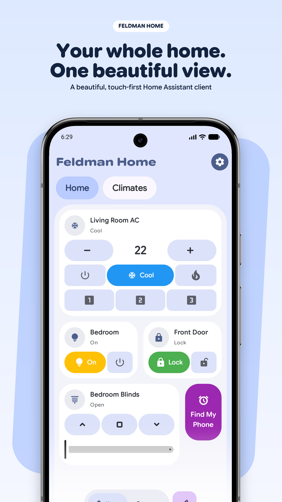
  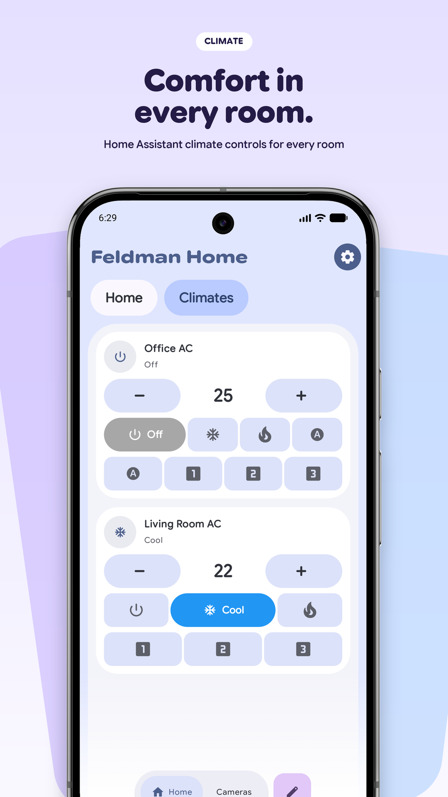
  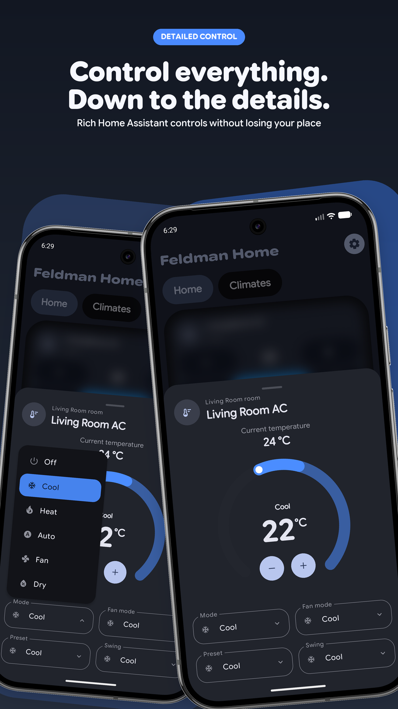
  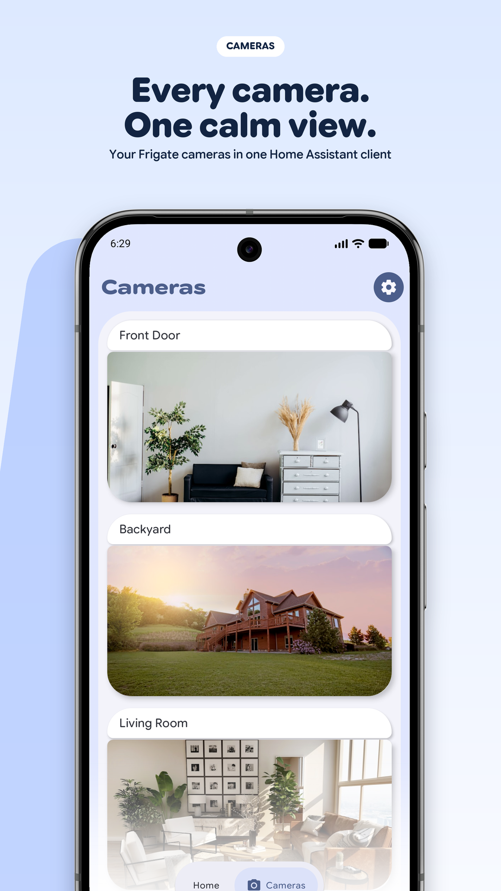

  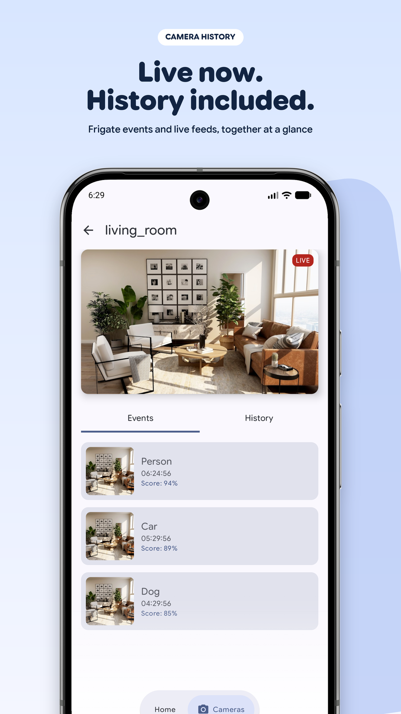
  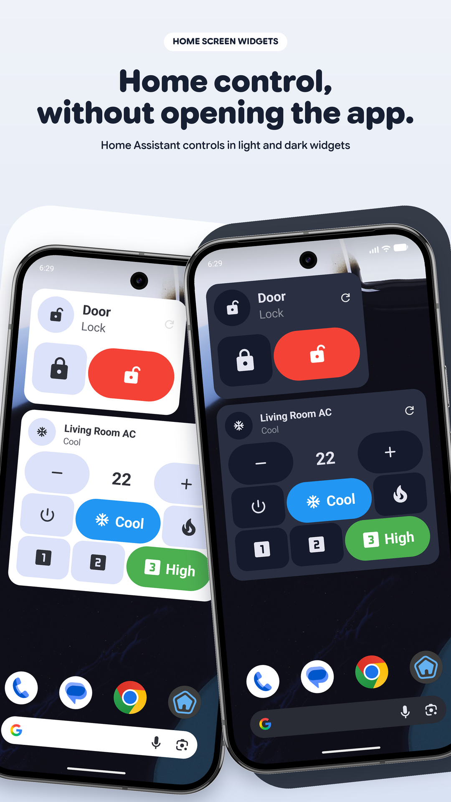
  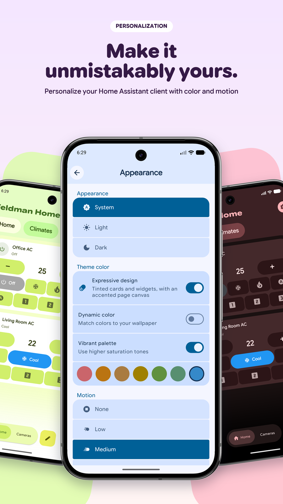
  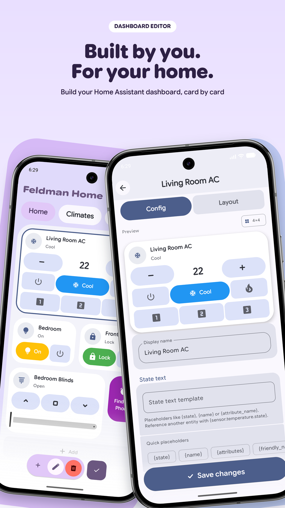

### Tablet

  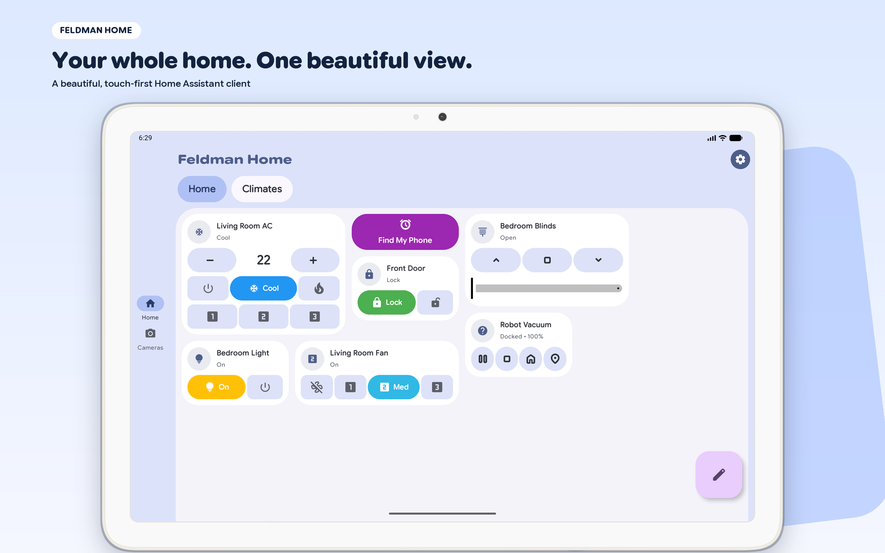
  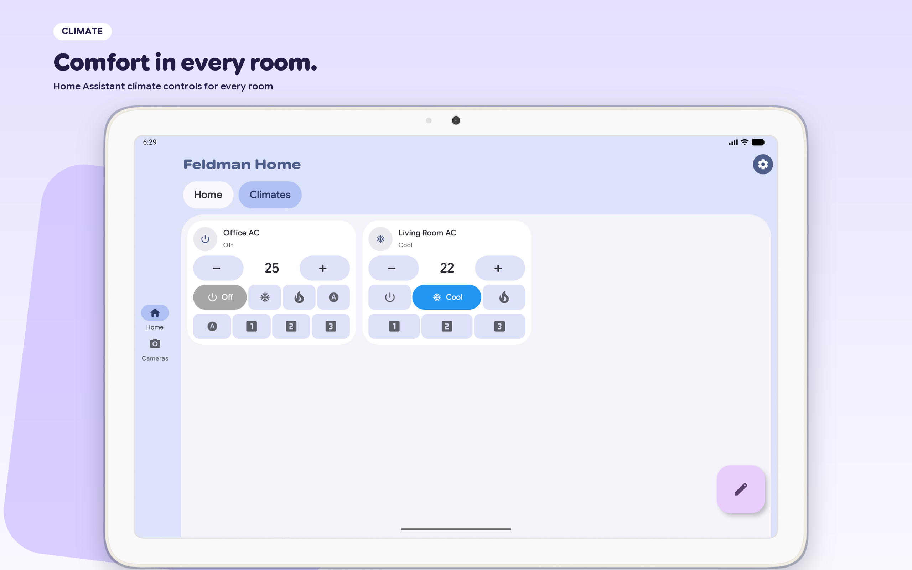

  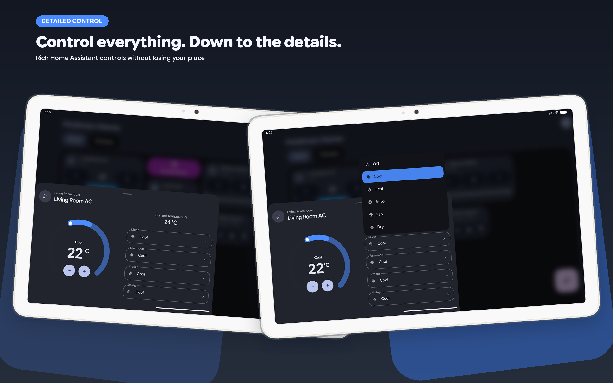
  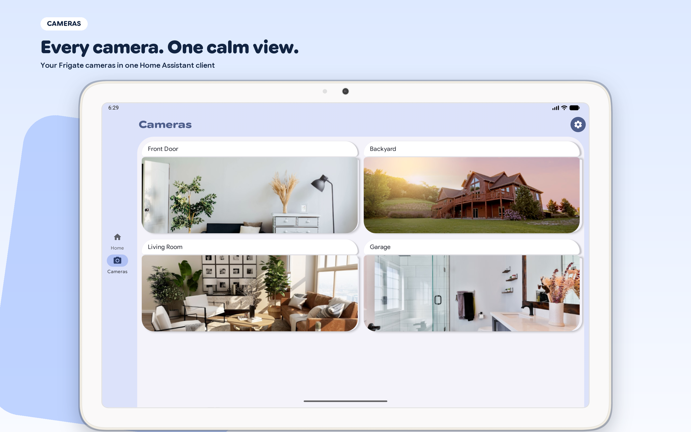

  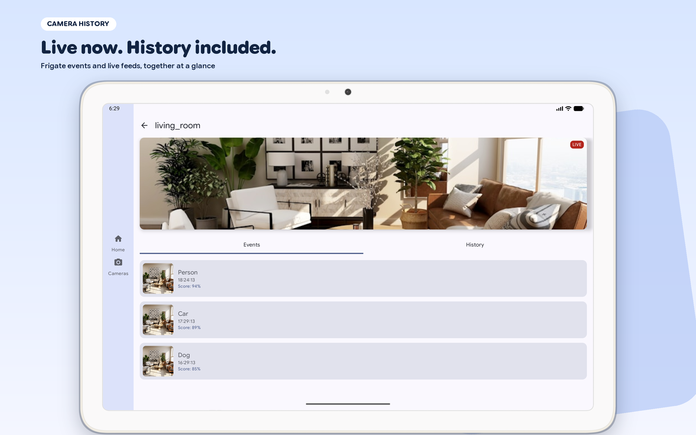
  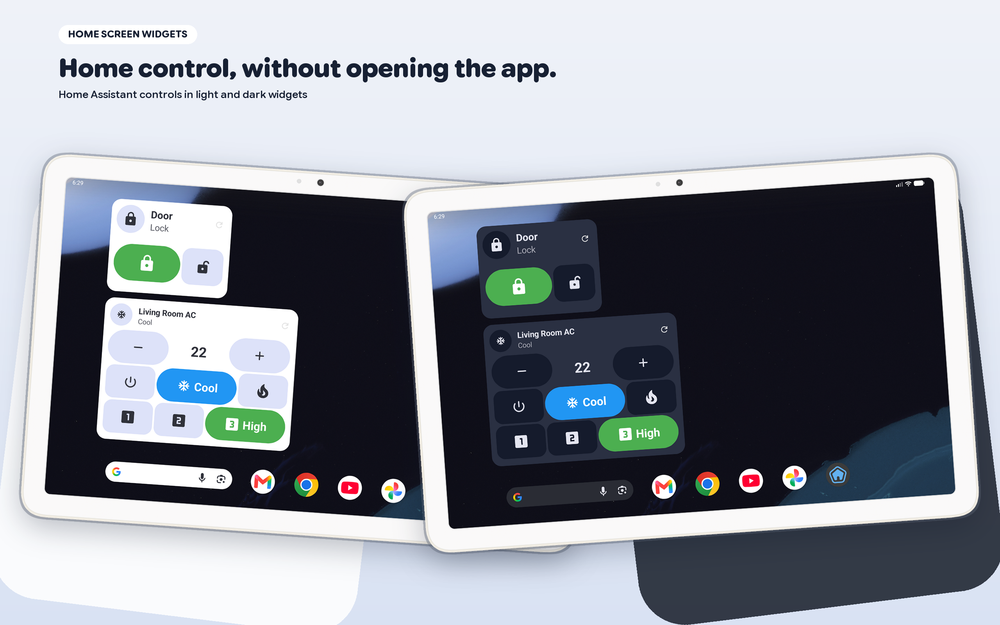

  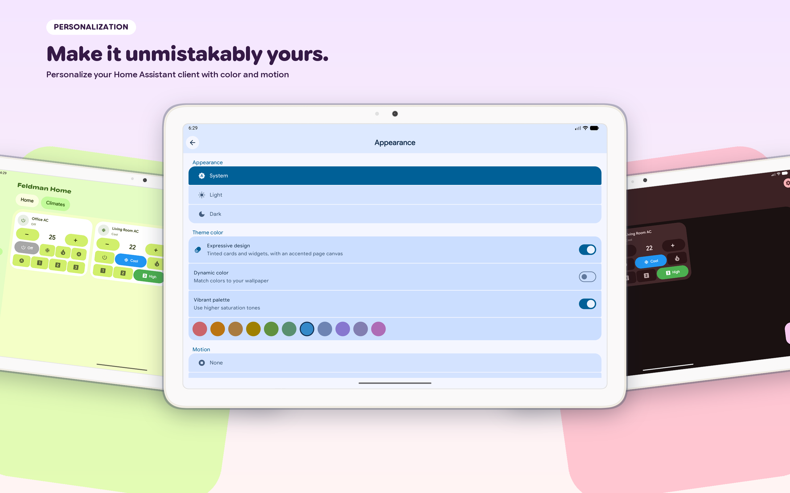
  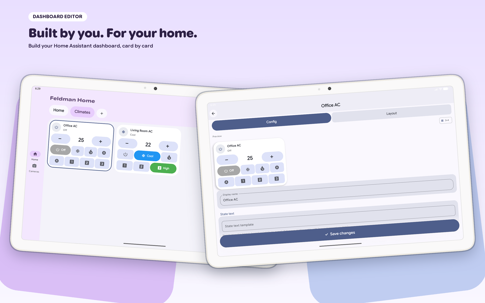

## Disclaimer

Feldman Home is an independent project and is not affiliated with, endorsed by, or connected to the Home Assistant project.
